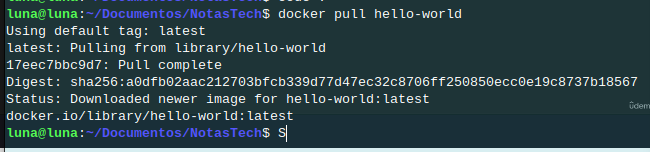
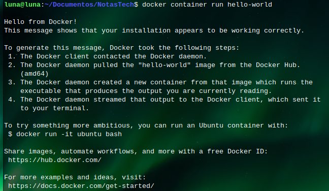

# 🐳 Docker – Comandos Básicos

## Temas puntuales de la sección

Esta sección introductoria a Docker, nos explicará cosas como: ¿Qué es Docker?, ¿Por qué debo de aprenderlo? y ¿Para qué me puede servir?.


También empezaremos con nuestros primeros comandos:

   docker container:

      run
      remove
      list
      publish
      environment variables
      logs
      detached
      
   docker pull


Adicionalmente les mostraré como hacer lo mismo que hicimos directamente desde Docker Desktop, pero les recomiendo fuertemente que primero aprendamos los comandos desde la consola antes de intentar hacer todo directamente desde Docker Desktop y así saber lo que hacen las GUIs (Graphic User Interfaces).

## 🐳 `docker pull`
Obtener imagen

```bash
docker pull hello-world
```


## 🏷️ Sobre la etiqueta :latest
:latest suele apuntar a la versión más estable o más reciente del mantenedor.
Descarga una imagen desde un repositorio remoto
## 📦 `docker run`

Ejecuta un contenedor desde una imagen.

```bash
docker run -it ubuntu bash
docker container run hello-world
```
1. -i: interactivo
2. -t: asigna una terminal
4. ubuntu: imagen base
5. bash: comando que ejecuta dentro del contenedor

```bash
luna@luna:~/Documentos/NotasTech$ docker container run hello-world

Hello from Docker!
This message shows that your installation appears to be working correctly.

To generate this message, Docker took the following steps:
 1. The Docker client contacted the Docker daemon.
 2. The Docker daemon pulled the "hello-world" image from the Docker Hub.
    (amd64)
 3. The Docker daemon created a new container from that image which runs the
    executable that produces the output you are currently reading.
 4. The Docker daemon streamed that output to the Docker client, which sent it
    to your terminal.

To try something more ambitious, you can run an Ubuntu container with:
 $ docker run -it ubuntu bash

Share images, automate workflows, and more with a free Docker ID:
 https://hub.docker.com/

For more examples and ideas, visit:
 https://docs.docker.com/get-started/

```



## 🧼 Limpieza de contenedores e imágenes

Cada vez que ejecutas docker run, creas un nuevo contenedor.
Aunque esté finalizado (exited), ocupa espacio.
Las imágenes también ocupan espacio aunque no se usen.
Se recomienda eliminar contenedores e imágenes innecesarios para mantener limpio tu entorno.

Lista todos los contenedores (incluyendo finalizados)
```bash
docker container --help
docker container ps -a
docker container ls -a
docker container rm
docker container prune

docker images --help
docker images -a

luna@luna:~/Documentos/NotasTech$ docker images -a
REPOSITORY                 TAG       IMAGE ID       CREATED       SIZE
hello-world                latest    a0dfb02aac21   7 days ago    20.3kB
docker/welcome-to-docker   latest    c4d56c24da4f   2 weeks ago   22.2MB

una@luna:~/Documentos/NotasTech$ docker image --help

Usage:  docker image COMMAND

Manage images

Commands:
  build       Build an image from a Dockerfile
  history     Show the history of an image
  import      Import the contents from a tarball to create a filesystem image
  inspect     Display detailed information on one or more images
  load        Load an image from a tar archive or STDIN
  ls          List images
  prune       Remove unused images
  pull        Download an image from a registry
  push        Upload an image to a registry
  rm          Remove one or more images
  save        Save one or more images to a tar archive (streamed to STDOUT by default)
  tag         Create a tag TARGET_IMAGE that refers to SOURCE_IMAGE

Run 'docker image COMMAND --help' for more information on a command.

```

## 🔗 Sobre Docker Hub

**    Docker descarga imágenes de Docker Hub por defecto.

Imágenes oficiales tienen la etiqueta Official Image.

Se recomienda usar imágenes oficiales por:

```python
        Buenas prácticas
        Seguridad (verificadas, sin malware)
        Actualizaciones regulares**
```


<!--Ctrl + Shift + V-->

## 🖼️ ¿Qué es una imagen Docker?
Es un archivo compuesto por capas que contiene todas las dependencias para ejecutarse.
    Contiene:

   - Sistema base
   - Dependencias
   - -Scripts 
   - Archivos binarios
   - Etc

Configuraciones necesarias para ejecutar una aplicación, es como una "plantilla congelada" para ejecutar algo.
## 📦 ¿Qué es un contenedor?

Un contenedor es una instancia ejecutándose de una imagen.
Corre en un entorno aislado, utilizando los recursos definidos por la imagen.
Cuando usas:

    docker container run hello-world

Estás creando y ejecutando un contenedor a partir de esa imagen.

## 🔁 ¿Qué pasa al ejecutar docker pull y luego docker run?

Docker descarga la imagen si no existe.
Verifica su firma con la de Docker Hub.
Si ya existe localmente y está actualizada, no la descarga otra vez.
Ejecutar docker container run hello-world lanza un contenedor que:
        Se ejecuta
        Imprime un mensaje
        Finaliza (por eso su estado es exited en Docker Desktop)

# Publish and detached mode
### docker container run -d docker/getting-started  <detached>
## Ejecutar imagen de forma desenlazada
```bash
luna@luna:~/Documentos/NotasTech$ docker container run -d docker/getting-started
ab4bca082ca0c3aac05e83b5933c3bbc229ac941df26b92b782c2b599afb7fd9
luna@luna:~/Documentos/NotasTech$ docker container ls
CONTAINER ID   IMAGE                             COMMAND                  CREATED         STATUS         PORTS                                     NAMES
ab4bca082ca0   docker/getting-started            "/docker-entrypoint.…"   3 minutes ago   Up 3 minutes   80/tcp                                    fervent_shockley
3ce7e663108d   docker/welcome-to-docker:latest   "/docker-entrypoint.…"   6 minutes ago   Up 6 minutes   0.0.0.0:8088->80/tcp, [::]:8088->80/tcp   welcome-to-docker
luna@luna:~/Documentos/NotasTech$ docker container stop fervent_shockley 
fervent_shockley
```
## Se pueden tener varias instancias del mismo contenedor en diferentes puertos
### docker container run -d -p 80:80 docker/getting-started <publish>
```bash
luna@luna:~/Documentos/NotasTech$ docker container run -d -p 80:80 docker/getting-started
e7189a4ee6f2983e41e1d4311542669cdb19f40067bd6d4c767b758ec027ad3e
luna@luna:~/Documentos/NotasTech$ docker container ls
CONTAINER ID   IMAGE                             COMMAND                  CREATED          STATUS          PORTS                                     NAMES
e7189a4ee6f2   docker/getting-started            "/docker-entrypoint.…"   18 seconds ago   Up 17 seconds   0.0.0.0:80->80/tcp, [::]:80->80/tcp       friendly_kowalevski
3ce7e663108d   docker/welcome-to-docker:latest   "/docker-entrypoint.…"   9 minutes ago    Up 9 minutes    0.0.0.0:8088->80/tcp, [::]:8088->80/tcp   welcome-to-docker
luna@luna:~/Documentos/NotasTech$ docker container stop e71
e71
luna@luna:~/Documentos/NotasTech$ docker container run -dp 8080:80 docker/getting-started
3f5c5fba6a61a8502c662ec319d03703953299fb8dc1fef070e844b8aafead21
luna@luna:~/Documentos/NotasTech$ docker container ls
CONTAINER ID   IMAGE                             COMMAND                  CREATED          STATUS          PORTS                                     NAMES
3f5c5fba6a61   docker/getting-started            "/docker-entrypoint.…"   5 seconds ago    Up 4 seconds    0.0.0.0:8080->80/tcp, [::]:8080->80/tcp   heuristic_burnell
3ce7e663108d   docker/welcome-to-docker:latest   "/docker-entrypoint.…"   13 minutes ago   Up 13 minutes   0.0.0.0:8088->80/tcp, [::]:8088->80/tcp   welcome-to-docker
```