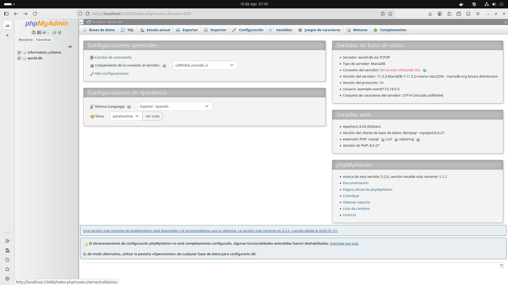

# Container Networking
Regla de oro:
Si dos o más contenedores están en la misma
red, podrán hablar entre sí. Si no lo están, no
podrán.
# 🚀 Docker + MariaDB + phpMyAdmin usando redes personalizadas

Este documento explica cómo conectar contenedores de MariaDB y phpMyAdmin usando una red personalizada de Docker.

---

## 🔧 1. Crear una red personalizada

```bash
docker network create world-net
```
🔧 Comandos de redes (docker network)
Crear una nueva red
```bash
docker network create todo-app
```
Listar todas las redes creadas
```bash
docker network ls
```
Inspeccionar una red
```bash
docker network inspect <NOMBRE_o_ID>
```
Eliminar todas las redes no usadas
```bash
docker network prune
```
Correr una imagen y unirla a la red
```bash
docker run -d \
--network todo-app --network-alias mysql \
-v todo-mysql-data:/var/lib/mysql \
-e MYSQL_ROOT_PASSWORD=secret \
-e MYSQL_DATABASE=todos \
mysql:8.0
```
Powershell

```bash
docker run -d `
--network todo-app --network-alias mysql `
-v todo-mysql-data:/var/lib/mysql `
-e MYSQL_ROOT_PASSWORD=secret `
-e MYSQL_DATABASE=todos `
mysql:8.0
```
## Ejercicio: Conectando MariaDB con PHPMYADMIN
```bash
luna@luna:~/Documentos/NotasTech$ docker network create world-app
2726a3704f6ec2d7f121f5468b449953d19b40619481f7cd7bed5b2d46112814
luna@luna:~/Documentos/NotasTech$ docker network ls
NETWORK ID     NAME        DRIVER    SCOPE
04f881560a48   bridge      bridge    local
f8e7bf4a6e8d   host        host      local
6fbddae35854   none        null      local
2726a3704f6e   world-app   bridge    local
luna@luna:~/Documentos/NotasTech$ docker container  ls -a
CONTAINER ID   IMAGE                     COMMAND                  CREATED          STATUS          PORTS                                         NAMES
c46d0fa23221   phpmyadmin:5.2.0-apache   "/docker-entrypoint.…"   20 minutes ago   Up 20 minutes   0.0.0.0:55000->80/tcp                         phpmyadmin
de6842b99a43   mariadb:jammy             "docker-entrypoint.s…"   27 minutes ago   Up 27 minutes   0.0.0.0:3306->3306/tcp, [::]:3306->3306/tcp   world-db
luna@luna:~/Documentos/NotasTech$ docker network connect world-app world-db
luna@luna:~/Documentos/NotasTech$ docker network connect world-app phpmyadmin
luna@luna:~/Documentos/NotasTech$ docker network inspect world-app
[
    {
        "Name": "world-app",
        "Id": "2726a3704f6ec2d7f121f5468b449953d19b40619481f7cd7bed5b2d46112814",
        "Created": "2025-08-16T07:40:08.116977407Z",
        "Scope": "local",
        "Driver": "bridge",
        "EnableIPv4": true,
        "EnableIPv6": false,
        "IPAM": {
            "Driver": "default",
            "Options": {},
            "Config": [
                {
                    "Subnet": "172.18.0.0/16",
                    "Gateway": "172.18.0.1"
                }
            ]
        },
        "Internal": false,
        "Attachable": false,
        "Ingress": false,
        "ConfigFrom": {
            "Network": ""
        },
        "ConfigOnly": false,
        "Containers": {
            "c46d0fa23221c519c94b050ebcbca78d6295e1bba17df431a96c04945466fc9b": {
                "Name": "phpmyadmin",
                "EndpointID": "7ca56ed9dba386b00ec3160c15900b527ffc80355e7812e1b512989825ea1291",
                "MacAddress": "12:ec:5b:cd:d4:e2",
                "IPv4Address": "172.18.0.3/16",
                "IPv6Address": ""
            },
            "de6842b99a4353673ab8710ad67faba8e728c1b811aa71144ac5a92abe14f4e9": {
                "Name": "world-db",
                "EndpointID": "c50d71505a0e8b39674352f3efedfaba462147003820be576e812ed4f6b9c0c9",
                "MacAddress": "42:50:ac:95:c1:85",
                "IPv4Address": "172.18.0.2/16",
                "IPv6Address": ""
            }
        },
        "Options": {
            "com.docker.network.enable_ipv4": "true",
            "com.docker.network.enable_ipv6": "false"
        },
        "Labels": {}
    }
]
luna@luna:~/Documentos/NotasTech$ 

```



```bash
```