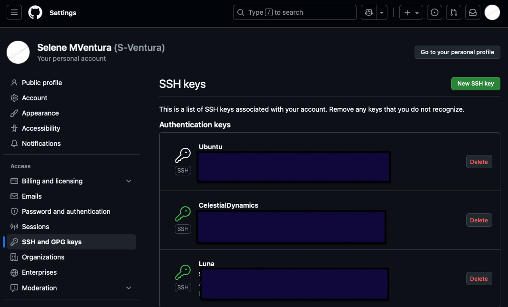
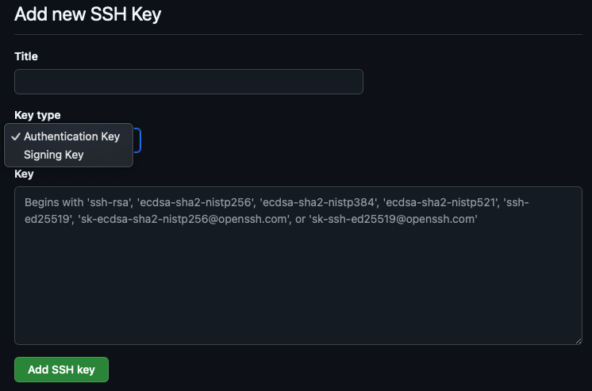

# 02 · Instalar y configurar Git

## Instalación rápida
### macOS
```bash
xcode-select --install          # instala las herramientas de línea de comando
brew install git                # instala la versión estable desde Homebrew
```

### Windows
1. Descarga el instalador desde <https://git-scm.com/download/win>.
2. Acepta las opciones por defecto salvo que tengas un motivo específico para cambiarlas.
3. Abre "Git Bash" para utilizar la terminal de Git.

### Linux (Debian/Ubuntu)
```bash
sudo apt update
sudo apt install git
```

## Validar la instalación
- Comprueba que Git está disponible y detecta la versión instalada:
  ```bash
  git --version
  which git          # macOS / Linux: ruta del ejecutable
  where git          # Windows (PowerShell / CMD)
  ```
- Si instalaste Xcode Command Line Tools en macOS, `git --version` deberá mostrar la versión de Homebrew; si no, revisa la ruta (`/usr/local/bin/git` o `/opt/homebrew/bin/git` en Apple Silicon).

## Configuración inicial
Define tu nombre y correo para que quede registrado en los commits:
```bash
git config --global user.name "Nombre Apellido"
git config --global user.email "tu_correo@example.com"
```

Riesgos:
- `--global` aplica a todos los repos; usa `--local` para configurar solo el actual.

Opcional: cambia el editor por defecto (ejemplo con VS Code):
```bash
git config --global core.editor "code --wait"
```

### Verifica tu configuración actual
```bash
git config --list
```
Para saber desde dónde llega cada ajuste usa:
```bash
git config --show-origin --list
```

## Configurar acceso por SSH a GitHub
### ¿Por qué usar SSH?
Trabajar con SSH evita escribir la contraseña cada vez que haces `git push` o `git pull`, añade una capa de seguridad y permite automatizar tareas sin exponer credenciales. Cada clave SSH identifica a tu equipo ante GitHub u otros remotos.

### 1. Crear una nueva clave SSH
```bash
ssh-keygen -t ed25519 -C "tu_correo@example.com"
```
- Cuando pregunte por la ubicación, presiona **Enter** para usar la ruta por defecto `~/.ssh/id_ed25519`.
- Define una passphrase: actúa como contraseña local si alguien roba la clave.

### 2. Cargar la clave en el agente SSH
Para que macOS (con Zsh como shell por defecto) recuerde la clave durante la sesión:
```bash
eval "$(ssh-agent -s)"
ssh-add --apple-use-keychain ~/.ssh/id_ed25519
```
Si quieres que se cargue automáticamente en cada nueva terminal, añade lo siguiente a `~/.zshrc`:
```bash
ssh-add --apple-use-keychain ~/.ssh/id_ed25519 2>/dev/null
```
En Linux o Windows (Git Bash) basta con `ssh-add ~/.ssh/id_ed25519`.

Alternativas:
- Usa HTTPS con Git Credential Manager si prefieres no gestionar llaves SSH.

### 3. Copiar la clave pública
```bash
pbcopy < ~/.ssh/id_ed25519.pub   # macOS
clip < ~/.ssh/id_ed25519.pub     # Windows (Git Bash)
cat ~/.ssh/id_ed25519.pub        # Linux, copia manualmente
```

### 4. Registrar la clave en GitHub
1. Accede a [GitHub.com](https://github.com) y haz clic en tu avatar.
2. En el menú, selecciona **Settings** → **SSH and GPG keys**.
3. Pulsa **New SSH key** (usa tus capturas `ssh_menu.png` y `ss_addkey.png` como referencia visual).



4. Coloca un título descriptivo (por ejemplo "MacBook Air") y pega la clave pública en el campo **Key**.



5. Guarda con **Add SSH key**.

### 5. Probar la conexión
```bash
ssh -T git@github.com
```
La primera vez, GitHub pedirá confirmar la huella digital; escribe `yes`. Debes ver un mensaje como `Hi username! You've successfully authenticated...`.

## Ajustes recomendados tras la instalación
- Establece la rama principal por defecto para repositorios nuevos (evita `master`):
  ```bash
  git config --global init.defaultBranch main
  ```
- Activa colores en la salida de la terminal si no lo hace por defecto:
  ```bash
  git config --global color.ui auto
  ```
- Windows: normaliza saltos de línea y almacena credenciales en el gestor oficial:
  ```bash
  git config --global core.autocrlf true         # usa false en macOS/Linux
  git config --global credential.helper manager  # Git Credential Manager
  ```
- Si necesitas cambiar algo puntual, usa `git config --global --edit` y Git abrirá el archivo de configuración en tu editor por defecto.

Riesgos:
- `core.autocrlf` mal configurado puede generar diffs ruidosos o cambios de fin de linea inesperados.

## Verificar repositorios y ramas
- Comprueba si estás dentro de un repositorio Git:
  ```bash
  git status                  # muestra el estado breve por defecto
  git status -sb              # versión compacta (short + branch)
  git rev-parse --is-inside-work-tree
  git rev-parse --show-toplevel
  ```
- Revisa las ramas disponibles y la rama activa:
  ```bash
  git branch                  # lista ramas locales
  git branch --show-current   # indica la rama en la que trabajas
  git branch -r               # remotas (origin/main, origin/dev, ...)
  ```
- Inspecciona los remotos configurados y su URL:
  ```bash
  git remote -v
  git remote show origin      # detalles de seguimiento de la rama principal
  ```
- Si acabas de clonar un repo, confirma que `origin/main` (o la rama principal equivalente) existe y está vinculada con `git branch -vv`. Verás cada rama local y el remoto al que apunta.

## Buenas prácticas
- Usa un correo asociado a la cuenta del servicio remoto (GitHub, GitLab, etc.).
- Mantén tus claves SSH seguras: protege la carpeta `~/.ssh` y rota la clave si pierdes el equipo.
- Repite la configuración sin `--global` dentro de un repositorio si necesitas datos distintos en un proyecto concreto.

## Resumen rapido
- Verifica la instalacion con `git --version` y revisa la ruta correcta.
- Configura nombre, email y editor con `git config`.
- Usa SSH o HTTPS segun tu preferencia y seguridad.

## Referencias oficiales (Git)

- https://git-scm.com/docs/git
- https://git-scm.com/docs/git-config
- https://git-scm.com/docs/git-status
- https://git-scm.com/docs/git-branch
- https://git-scm.com/docs/git-remote
- https://git-scm.com/docs/git-rev-parse
